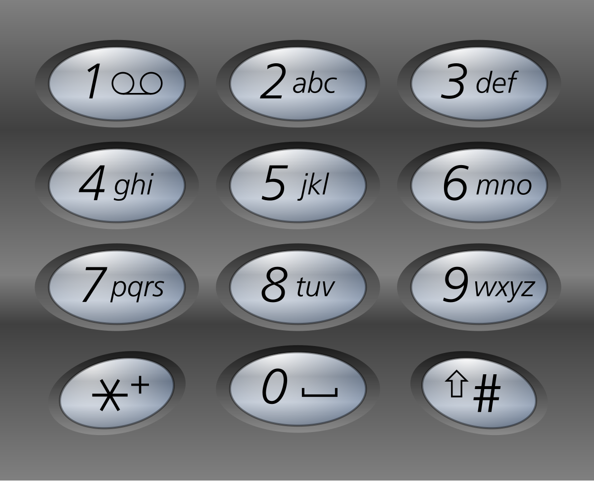

# 17. Letter Combinations of a Phone Number
## (Medium)

Given a string containing digits from 2-9 inclusive, return all possible letter combinations that the number could represent. 
<br>
Return the answer in any order.
<br>
A mapping of digits to letters (just like on the telephone buttons) is given below. 
<br>
Note that 1 does not map to any letters.
<br>



Example 1:

```
Input: digits = "23"
Output: ["ad","ae","af","bd","be","bf","cd","ce","cf"]
```

Example 2:

```
Input: digits = ""
Output: []
```

Example 3:

```
Input: digits = "2"
Output: ["a","b","c"]
```

Constraints:

- `0 <= digits.length <= 4`
- `digits[i]` is a digit in the range `['2', '9']`.