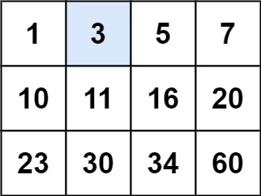

# 74. Search a 2D Matrix
## (Medium)

You are given an m x n integer matrix matrix with the following two properties:
<br>
Each row is sorted in non-decreasing order. <br>
The first integer of each row is greater than the last integer of the previous row. <br>
Given an integer target, return true if target is in matrix or false otherwise. <br>
<br>
You must write a solution in O(log(m * n)) time complexity.
<br>
 

Example 1:



```
Input: matrix = [[1,3,5,7],[10,11,16,20],[23,30,34,60]], target = 3
Output: true
```

Example 2:


```
Input: matrix = [[1,3,5,7],[10,11,16,20],[23,30,34,60]], target = 13
Output: false
```

Constraints:

- m == matrix.length
- n == matrix[i].length
- 1 <= m, n <= 100
- -104 <= matrix[i][j], target <= 104