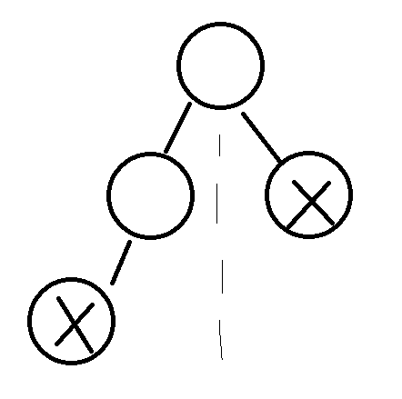
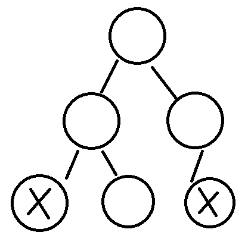

The trick to this question is at least one of these is always true:  
Case 1: The left subtree is full 
Case 2: The right subtree is full 
 
Full simply means that the tree is fully filled in, or more technically that no node has only 1 child.
 
I sketched these trees to show the intuition, and put an 'X' on the leftmost node in both subtrees:
 

 

 
Since the tree is complete, each depth is filled in left to right. That means, if the two 'X' nodes have the same depth, the left subtree must be full!
 
If they do not, then the right subtree must be full!
 
Once we know a tree of depth X is full, we can count the number of nodes without visiting them.
 

## Approach
1) Get the 'left depth' of both left and right subtrees  
2) If they are the same, then count the left subtree with simple math, and recursively call it on the right subtree  
3) Otherwise, count the right subtree with simple math, and recursively call it on the left subtree.  

## Complexity
- Time complexity: O(logn). At every step, you are disregarding half the tree. Think about it like this: You never wasted time visiting the nodes in the tree you found to be full, except on the left-most path (negligible). Since you shrink the input by half every time, it is logn. Technically, the (negligible) portion would make this algorithm (logn)^2, but practically it makes little difference as it operates similarly to log. You can also optimize this by skipping the branch you already computed and adding the depth, but it would make the solution less readable.

 

- Space complexity: O(logn), as that is the maximum recursion depth, which is our space usage.