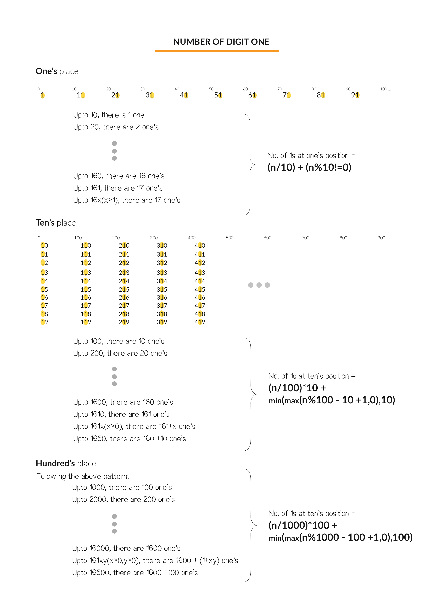

# Solve it Mathematically



From the figure, we can see that from digit '1' at `ones` place repeat in group of 1 after interval of 10. Similarly, '1' at tens place repeat in group of 10 after interval of 100. <br>
This can be formulated as `(n/(i∗10))∗i`.
<br>
Also, notice that if the digit at tens place is '1', then the number of terms with '1' is increased by x+1, if the number is say "ab1x". As if digits at tens place is greater than 1, then all the 10 occurances of numbers with '1' at tens place have taken place, hence, we add 10.<br>
This is formluated as `min⁡(max⁡((n mod (i*10))−i+1,0),i)`.
<br>
Lets take an example, say n=1234.
<br>

No of ’1’\text{'1'}’1’ in ones\text{ones}ones place = 1234/101234/101234/10(corresponding to 1,11,21,...1221) + min⁡(4,1)\min(4,1)min(4,1)(corresponding to 1231) =124124124

No of ’1’\text{'1'}’1’ in tens\text{tens}tens place = (1234/100)∗10(1234/100)*10(1234/100)∗10(corresponding to 10,11,12,...,110,111,...1919) +min⁡(21,10)\min(21,10)min(21,10)(corresponding to 1210,1211,...1219)=130130130

No of ’1’\text{'1'}’1’ in hundreds\text{hundreds}hundreds place = (1234/1000)∗100(1234/1000)*100(1234/1000)∗100(corresponding to 100,101,12,...,199) +min⁡(135,100)\min(135,100)min(135,100)(corresponding to 1100,1101...1199)=200200200

No of ’1’\text{'1'}’1’ in thousands\text{thousands}thousands place = (1234/10000)∗10000(1234/10000)*10000(1234/10000)∗10000 +min⁡(235,1000)\min(235,1000)min(235,1000)(corresponding to 1000,1001,...1234)=235235235

Therefore, Total = 124+130+200+235=689124+130+200+235 = 689124+130+200+235=689.

Herein, one formula has been devised, but many other formulae can be devised for faster implementations, but the essence and complexity remains the same. The users are encouraged to try to devise their own version of solution using the mathematical concepts.

```cpp
int countDigitOne(int n) {
    int countr = 0;
    for (long long i = 1; i <= n; i *= 10) {
        long long divider = i * 10;
        countr += (n / divider) * i + min(max(n % divider - i + 1, 0LL), i);
        // 0LL is number zero in long long format
    }
    return countr;
}
```

Complexity analysis

- Time complexity: O(log10(n)).
- - No of iterations equal to the number of digits in n which is log10(n).
- Space complexity: O(1) space required.