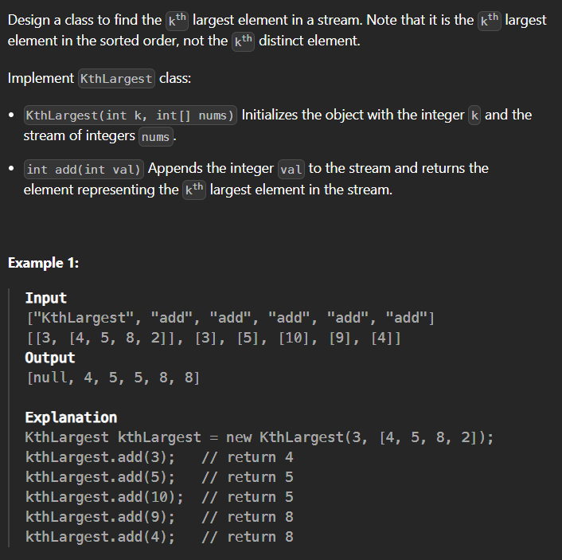

# 703. Kth Largest Element in a Stream
## (Easy)

Constraints:

- `1 <= k <= 10^4`
- `0 <= nums.length <= 10^4`
- `-10^4 <= nums[i] <= 10^4`
- `-10^4 <= val <= 10^4`
- At most `10^4` calls will be made to add.
- It is guaranteed that there will be at least k elements in the array when you search for the `kth` element.