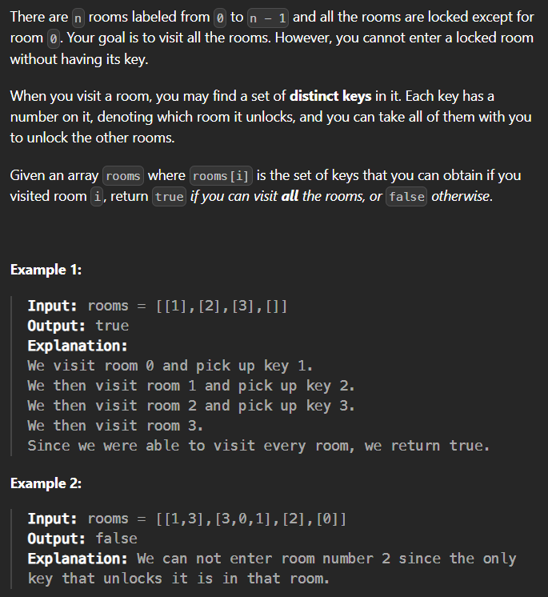

# 841. Keys and Rooms
## (Medium)

**Constraints:**

- `n == rooms.length`
- `2 <= n <= 1000`
- `0 <= rooms[i].length <= 1000`
- `1 <= sum(rooms[i].length) <= 3000`
- `0 <= rooms[i][j] < n`
- All the values of `rooms[i]` are unique.