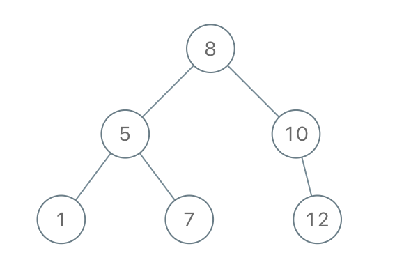

# 1008. Construct Binary Search Tree from Preorder Traversal
## (Medium)

Given an array of integers preorder, which represents the preorder traversal of a BST (i.e., binary search tree), construct the tree and return its root.

It is guaranteed that there is always possible to find a binary search tree with the given requirements for the given test cases.

A binary search tree is a binary tree where for every node, any descendant of `Node.left` has a value strictly less than `Node.val`, and any descendant of `Node.right` has a value strictly greater than Node.val.

A preorder traversal of a binary tree displays the value of the node first, then traverses `Node.left`, then traverses `Node.right`.

 

Example 1:



```
Input: preorder = [8,5,1,7,10,12]
Output: [8,5,10,1,7,null,12]
```

Example 2:

```
Input: preorder = [1,3]
Output: [1,null,3]
```

Constraints:

- `1 <= preorder.length <= 100`
- `1 <= preorder[i] <= 1000`
- All the values of `preorder` are unique.