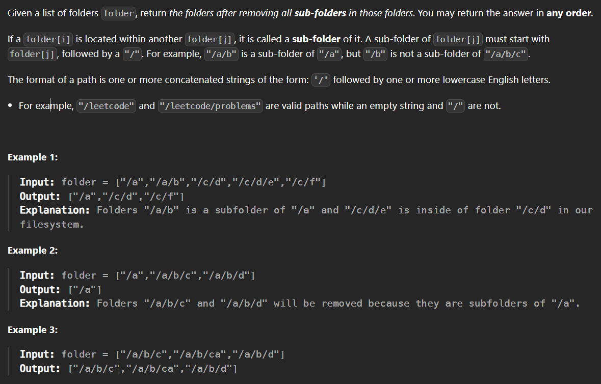

# 1233. Remove Sub-Folders from the Filesystem
## (Medium)

Constraints:

- `1 <= folder.length <= 4 * 10^4`
- `2 <= folder[i].length <= 100`
- `folder[i]` contains only lowercase letters and `'/'`.
- `folder[i]` always starts with the character `'/'`.
- Each folder name is unique.