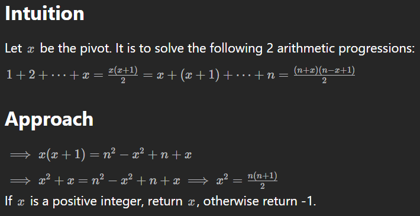

# 2485. Find the Pivot Integer
## (Easy)

Given a positive integer `n`, find the **pivot integer** `x` such that:

- The sum of all elements between `1` and `x` inclusively equals the sum of all elements between `x` and `n` inclusively.

Return the *pivot integer* `x`. If no such integer exists, return `-1`. It is guaranteed that there will be at most one pivot index for the given input.

 

Example 1:

```
Input: n = 8
Output: 6
Explanation: 6 is the pivot integer since: 1 + 2 + 3 + 4 + 5 + 6 = 6 + 7 + 8 = 21.
```

Example 2:

```
Input: n = 1
Output: 1
Explanation: 1 is the pivot integer since: 1 = 1.
```

Example 3:

```
Input: n = 4
Output: -1
Explanation: It can be proved that no such integer exist.
```

**Constraints:**

- `1 <= n <= 1000`


## Solution:

