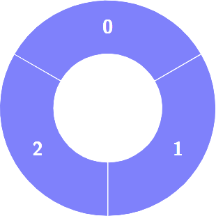
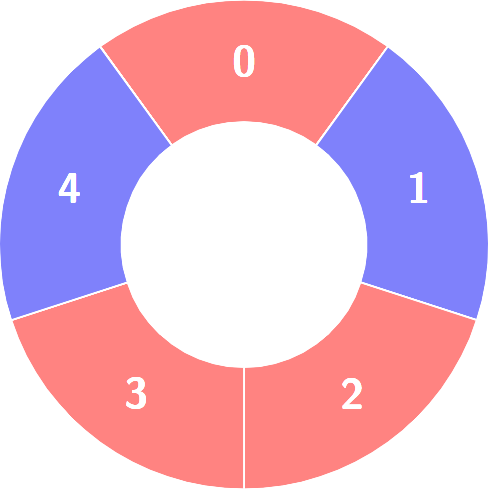
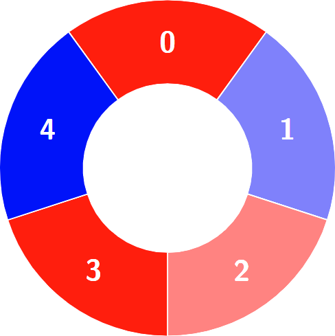
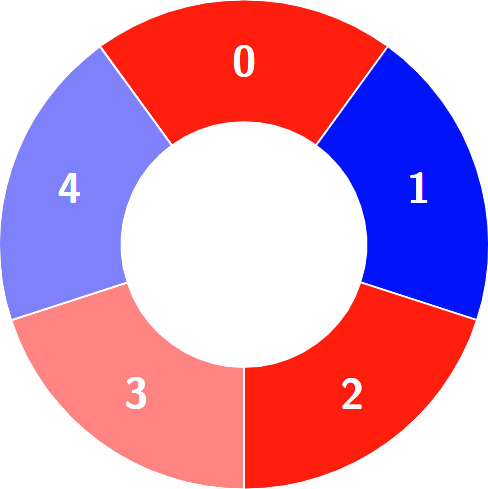

# 3206. Alternating Groups I
## (Easy)

There is a circle of red and blue tiles. You are given an array of integers `colors`. The color of tile `i` is represented by `colors[i]`:

- `colors[i] == 0` means that tile `i` is red.
- `colors[i] == 1` means that tile `i` is blue.

Every 3 contiguous tiles in the circle with **alternating** colors (the middle tile has a different color from its **left** and **right** tiles) is called an **alternating** group.

Return the number of **alternating** groups.

**Note** that since `colors` represents a circle, the first and the last tiles are considered to be next to each other.
 

Example 1:

```
Input: colors = [1,1,1]
Output: 0
Explanation:
```



Example 2:

```
Input: colors = [0,1,0,0,1]
Output: 3
Explanation:
```



Alternating groups:





Constraints:

- `3 <= colors.length <= 100`
- `0 <= colors[i] <= 1`