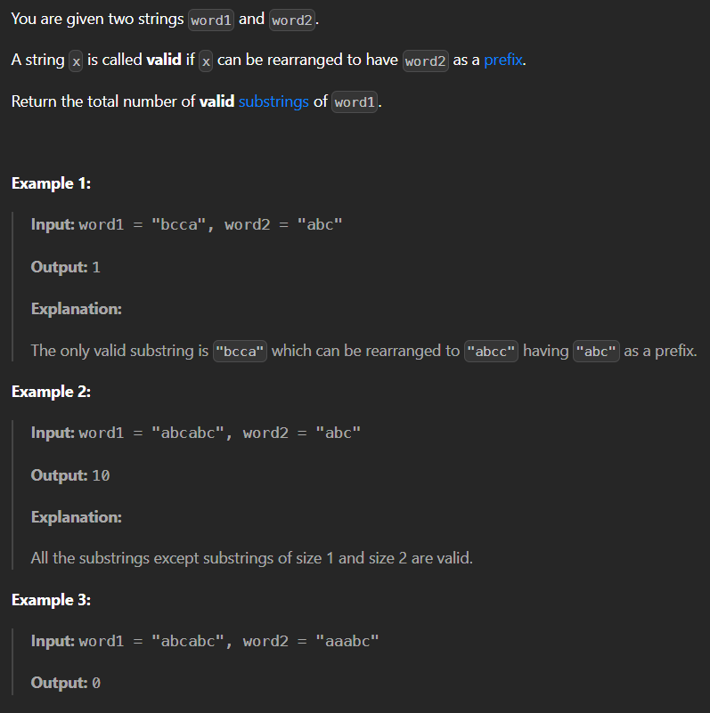

# 3297. Count Substrings That Can Be Rearranged to Contain a String I
## (Medium)

Constraints:

- `1 <= word1.length <= 10^5`
- `1 <= word2.length <= 10^4`
- `word1` and `word2` consist only of lowercase English letters.