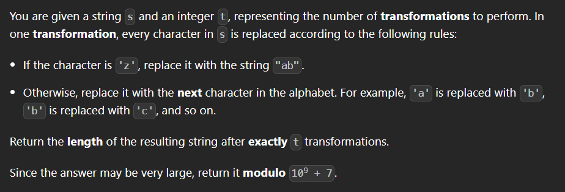

# 3335. Total Characters in String After Transformations I
## (Medium)



Example 1:

```
Input: s = "abcyy", t = 2
Output: 7
Explanation:
First Transformation (t = 1):
'a' becomes 'b'
'b' becomes 'c'
'c' becomes 'd'
'y' becomes 'z'
'y' becomes 'z'
String after the first transformation: "bcdzz"
Second Transformation (t = 2):
'b' becomes 'c'
'c' becomes 'd'
'd' becomes 'e'
'z' becomes "ab"
'z' becomes "ab"
String after the second transformation: "cdeabab"
Final Length of the string: The string is "cdeabab", which has 7 characters.
```

Example 2:

```
Input: s = "azbk", t = 1
Output: 5
Explanation:
First Transformation (t = 1):
'a' becomes 'b'
'z' becomes "ab"
'b' becomes 'c'
'k' becomes 'l'
String after the first transformation: "babcl"
Final Length of the string: The string is "babcl", which has 5 characters.
``` 

Constraints:

- `1 <= s.length <= 10^5`
- `s` consists only of lowercase English letters.
- `1 <= t <= 105`